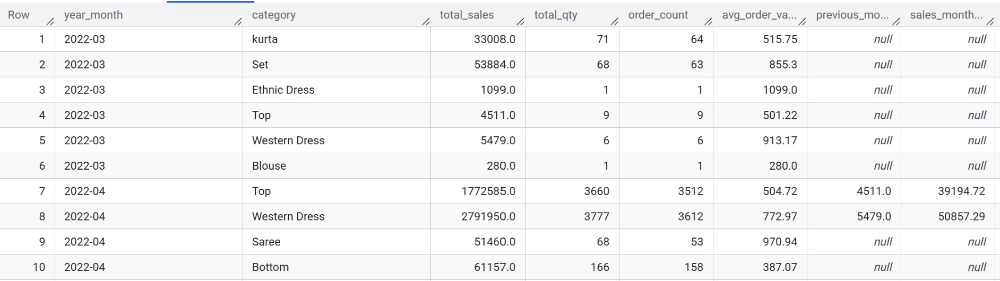

## Amazon Sales Analytics Pipeline
A modern end-to-end data pipeline project built with **Python, BigQuery, and dbt**, designed to transform raw e-commerce sales data into business-ready analytical marts. 


This project demonstrates a full **data engineering + analytics engineering workflow**, following raw data ingestion → staging → mart → KPI-ready reporting tables.

---

## Table of Contents
1. [Project Overview](#project-overview)
2. [Business Objective](#business-objective)
3. [Pipeline Flow / Data Architecture](#pipeline-flow&data-architecture)
4. [Tech Stack](#tech-stack)
5. [Project Structure](#project-structure)
6. [Data Pipeline Layers](#data-pipeline-layers)
7. [Key Analytical Outputs](#key-analytical-outputs)
8. [How to Run](#how-to-run)
9. [Key Learnings](#key-learnings)
10. [Future Improvements](#future-improvements)

---

## 1. Project Overview

This project simulates a real-world e-commerce Amazon sales analytics pipeline.

The pipeline ingests raw Amazon sales CSV data, loads it into BigQuery, and applies a layered dbt transformation framework to create clean staging models and business-facing marts.

Final outputs include:

- Monthly category sales
- Order volume
- Quantity sold
- Average order value
- Month-over-month growth

---

## 2. Business Objective

The goal of this project is to answer key business questions such as:

- Which product categories generate the highest sales?
- How does category performance change over time?
- What is the month-over-month sales growth?
- Which categories are growing or declining?

This mirrors real-world use cases in:

- e-commerce analytics
- product performance tracking
- business intelligence dashboards

---

## 3. Pipeline Flow & Data Architecture

### Pipeline Flow

#### (1) Ingestion Layer
Raw CSV files are loaded into BigQuery using Python.

```text
Raw CSV Data → Python ETL → BigQuery raw table
```

#### (2) Staging Layer
The staging model standardizes filed names and prepares clean columns for downstrea analytics.

Example transformations:
- rename columns
- data type standardization
- column cleaning
- business-friendly naming
    
#### (3) Mart Layer
The mart layer aggregates sales KPIs by
- `year_month`
- `category`

Key Mertics:
- total sales
- total quantity
- order count
- average order value

#### (4) Growth Analytics Layer
Built using SQL windows functions:
```
SQL

lag(total_sales) over (
    partition by category
    order by year_month
)
```

This calculates:
Includes:
- previous month sales
- sales growth amount
- month-over-month growth %

---

### Data Architecture (Medallion Style)

Bronze: raw_amazon_sales

Silver: stg_amazon_sales

Gold: mart_category_monthly_sales

Gold+: mart_category_monthly_sales_growth

--- 

## 4. Teck Stack

- **Python** → ingestion & loading
- **Pandas** → sample generation
- **BigQuery** → cloud data warehouse
- **dbt** → transformation & data modeling
- **SQL** → staging + mart layer modeling
- **Git / GitHub** → version control
- **dbt Docs** → lineage & documentation

---

## 5. Project Structure
```text
Markdown

Amazon Sales Analytics Pipeline/
│
├── ingestion/
│   ├── create_sample.py
│   └── load_to_bigquery.py
│
├── dbt/
│   ├── models/
│   │   ├── staging/
│   │   │   └── stg_amazon_sales.sql
│   │   └── marts/
│   │       ├── mart_category_monthly_sales.sql
│   │       └── mart_category_monthly_sales_growth.sql                 
│   │
│   ├── dbt_project.yml
│   
│
└── README.md
```

---

## 6. Key Analytical Outputs

### Monthly Category Sales Mart
Includes:
- total sales
- order count
- total quantity
- average order value


### Growth KPI Mart
Includes:
- previous month sales
- sales growth amount
- month-over-month growth %




---


### Business Insights Example

Example KPI fields:

- `total_sales`
- `total_qty`
- `order_count`
- `avg_order_value`
- `previous_month_sales`
- `sales_month_growth`

This allows trend monitoring across product categories.

---

## 7. Data Quality Tests
Implemented dbt tests for 
- not_null
- uniqueness
- schema validation

Example:
```
YAML

tests:
    - not_null
```

---

## 8. Documentation &Lineage
dbt docs was generated to visualize model lineage:
```
raw_amazon_sales
    ↓
stg_amazon_sales
    ↓
mart_category_monthly_sales
    ↓
mart_category_monthly_sales_growth
```

---

## 9. How to Run
### Python ingestion
```
Bash

Python ingestion/load_to_bigquery.py

```
### dbt Models
```
Bash

dbt run
```

### dbt Tests
```
Bash

dbt test
```

### dbt Documentation
```
Bash

dbt docs generate
dbt docs serve
```

---


## 10. Key Learnings Outcomes
This project demonstrates:
- ETL/ELT pipeline development
- Clould warehouse integration
- Medallion architecture
- dbt modular data modeling
- dimensional mart design
- SQL window function
- dbt lineage & data quality test in dbt
- Git branching workflow
- Analytical KPI design


---


## 11. Further improvements
Potential next steps:

- Automated pipeline orchestration (Airflow) 
- Dashboard layer (Tableau/ Power BI / Looker Studio)
- CI/CD deployment
- Incremental models


